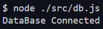

# Yum-Yum App Express 🚀
¡Bienvenido!, Aplicación para eccomerce web.

Este repositorio contiene el código y un par de ejemplos de uso de la Api expuesta por este backend creado con Express Js.

### Enlace del repositorio:
[Yum-Yum-Express](https://github.com/CobosFelipe/Yum-Yum-Express.git)

## 🗒 Requisitos
Estas dependencias deben estar en esta version o superior.

[Node v22.14.0](https://nodejs.org/es/)<br>
[Npm v10.9.2 (Se incluyé con node)](https://nodejs.org/es/)<br>
[Bcrypt v6.0.0](https://www.npmjs.com/package/bcrypt)<br>
[Cors v2.8.5](https://www.npmjs.com/package/cors)<br>
[Express v5.1.0](https://www.npmjs.com/package/express)<br>
[Joi v18.0.1](https://www.npmjs.com/package/joi)<br>
[Morgan v1.10.1](https://www.npmjs.com/package/morgan)<br>
[Nodemon v3.1.10 (Desarrollo)](https://www.npmjs.com/package/nodemon)<br>
[Pg v8.16.3](https://www.npmjs.com/package/pg)

## 💻 Instalación
### Clonar repositorio
Para instalar el proyecto se debe clonar el repositorio (Enlace arriba) ☝ con el siguiente script o comando:

```bash
git clone https://github.com/CobosFelipe/Yum-Yum-Express.git
```
### Instalar proyecto y dependencias
Una vez clonado abrir el directorio del proyecto con el editor de código de preferencia y en la terminal ejecutar el siguiente script o comando:

```bash
npm install
# Ó
npm i
```


### Ejecutar el proyecto
Para finalizar para ejecutar el proyecto se debe ejecutar el siguiente script o comando:

```bash
#Para desarrollo
npm run dev
```
```bash
#Para producción
node app.js
```

## 📚Contenido
A continuación se describe el contenido de cada carpeta principal del repositorio.

### 📁DB
Esta carpeta contiene un archivo .SQL con los scripts para la creación de las tablas del proyecto.
Estas tablas son:
* **users: 🧔** Esta tabla va a contener la información de los usuarios, varios datos pueden cambiarse dependiendo de las necesidades de cada negocio.
Algunas columnas considero importantes e indispensables en esta tabla son
    * **user_id:** El identificador unico para cada usuario o llave primaria de la tabla.
    * **user_name:** El nombre del usuario, esto puede usarse para loggearse ó en su defecto puede usarse...
    * **user_email:** Ó solo email, además de usarse para identificar al usuario, hacer un loggin o incluso hacer una validación de credeciales, se puede utilizar como metodo de contacto.
* **category: 📎** Esta tabla es opcional, depende mucho del diagrama entidad relación o del negocio en sí, puede emplearse como tabla intermedia o para hacer mas sencillo estructurar las consultas y llamadas a base de datos.
* **products: 🛍** Esta tabla es casi indispensable para cualquier negocio, incluso si lo que se ofrecen son servicios y no productos, pueden listarse aqui datos importantes de estos y algunos datos que considero muy importantes o indispensables en esta tabla, son:
    * **product_id:** Identificador unico de cada producto y llave primaria de la tabla.
    * **fk_category_id:** Llave foránea a la tabla de categorías (Si se usa) para facilitar consultas y organizar los productos en consultas mas complejas.
    * **product_name:** Nombre del producto, necesario para dar detalle y descripción del mismo.
    * **price:** Este podría ser opcional, por ejemplo si lo que se ofrecen son servicios y sus precios o valores estan sujetos a otras especificaciones o estan relacionados con cotizaciones. (En este caso se usan valores enteros y no de punto flotante debido a que para este caso no se ocupan)
* **orders: 🚛** Otra tabla que es muy condicional, depende mucho del diagrama, de como se plantee el proyecto y del mismo en sí. En caso de que se quiera usar las columnas necesarias para esta tabla son:
    * **order_id:** Identificador de la orden y llave foránea de la tabla.
    * **amount:** Montó total de la orden.
    * **others:** En este caso las demás columnas se pueden ajustar a demanda según el proyecto y las necesidades del mismo.    
* **order_items: 💎** Esta tabla se puede utilizar como una tabla de logs, esto debido a que se pueden crear registros con información que podrían verse o usarse en facturas o recibos de pago, también se pueden ajustar a las necesidades y no es obligatorio en todos los proyectos. Si se usa es indispensable que cuente con:
    * **order_item_id:** Como en todas las anteriores tablas este es el identificador de los registros y la llave primaria de la tabla.
    * **fk_order_id: (Opcional)** solo si se crea la tabla anteriormente mencionada, pero puede usarse para relacionar datos que también podrían necesitarse en una factura o recibo y así evitar la redundancia de datos o el reprocesamiento de datos para conseguir esta información.
    * **products:** Esta columna se puede replantear de otras maneras para mejorar la eficiencia de las consultas si se van a realizar en lotes o si se necesita el mayor rendimiendo, pero para este proyecto no se harán consumos por lotes o consultas muy complejas, así que para este caso se puede almacenar un objeto json con la informacion de los productos o servicios adquiridos.

### 📂SRC
Esta carpeta contiene una lista de archivos y subdirecctorios.

En esta caso solo hay un archivo en este nivel:
* **📂db.js:** Este archivo contiene la informacion y la configuración para la conexion a la base de datos.
(Se recomienda configurar las variables de la misma en variables de entorno, por seguridad).
* Adicional se adjunta un fragmento de código para comprobar la conexion a la base de datos y otro para la ejecución del mismo.

```javascript
//Comprobar conexion a base de datos
try {
   await db.query("SELECT NOW()");
   console.log("DataBase Connected");
 } catch (error) {
   console.log(error);
}
```

Para ejecutar **Solo** este archivo basta con ejecutar en la terminal el siguiente comando:

```bash
node ./src/db.js
```

Si la conexión fue exitosa nos devolverá el siguiente mensaje: <br>



De lo contrario la consola retornara un mensaje de error.
Para consultar la documentación de la colección de modulos puede visitar el siguiente enlace. <a target="_blank" src="https://node-postgres.com/features/connecting">Node postgres</a>

#
**📂Controllers:** Esta carpeta contiene los archivos de tipo controlador de la aplicación. Estos procesan las solicitudes de los usuarios y administran la logica de los mismos.

**📂Middlewares:** En este subdirectorio se encuentran funciones intermedias que se ejecutan antes de la recepcion de peticiones y antes de regresar una respuesta.
Para este proyecto en especifico se agregaron para estandarizar la respuesta de los servicios, además de automatizar procesos que pueden ser repetitivos y mejor manejados si están centralizados.

**📂Models:** Este subdirectorio contiene archivos de tipo modelo donde se estandarizan, organizan y almacenan los scripts o queries que se usaran para realizar diferentes acciones en la base de datos.

**📂 Routes:** Este subdirectorio contiene archivos donde se organizan las rutas de la aplicación, esto se hace para tener un mayor orden de los mismos para que esto no entorpezca el posible crecimiendo de la aplicación.

**📂 Schemas:** En este directorio se encuentran los esquemas se van a utilizar en los servicios para definir sus entradas, ya sea por tipo de dato, longitud u otros.

**📂 Utilities:** Este ultimo directorio, pero no menos importante contiene diferentes archivos y metodos que pueden hacer mas sencillos otros procesos en el resto del proyecto, aqui se puede agregar código sencillo que se utiice en toda la aplicación.

## ⌨ Directorio raíz del proyecto
En este nivel se encuentran archivos esenciales para el funcionamiento de la aplicación.
* **app.js:** Este es el archivo desde el que se ejecuta la aplicación, contiene varias dependencias criticas para el correcto funcionamiento del mismo.
* **.env:** Este archivo contiene las variables de entorno de la aplicación. (No está presente en el repositorio)
* **.gitignore:** Este archivo contiene el nombre de archivos o de tipos de archivos que se quieren excluir para que no se suban al repositorio. (Variables de entorno o los módulos de Node...)
* **package.json y lock.json:** Estos archivos contienen información de las dependencias y configuraciones del proyecto, estos son esenciales para garantizar instalaciones consistentes en diferentes entornos.
* **readme.md:** Es este documento, brinda información importante sobre el proyecto, su instalación y el como se compone.